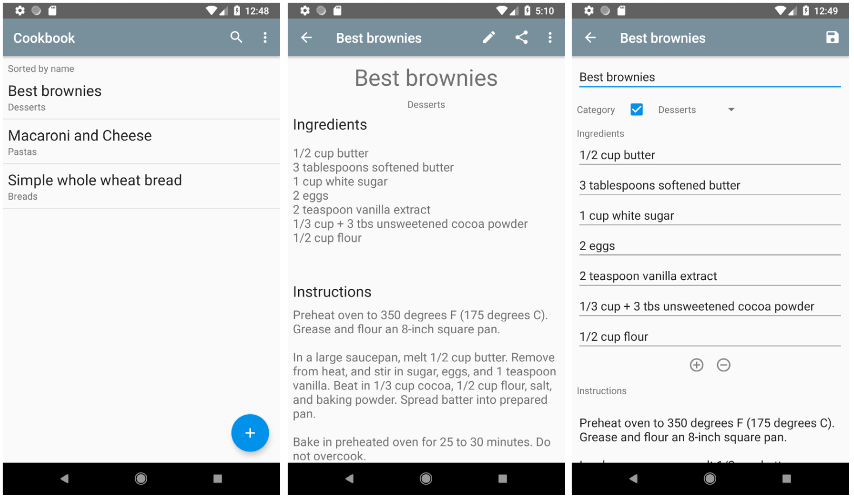

## Features
* Create & edit recipes
* Optionally assign categories to recipes
* Create & edit categories
* Sort recipes alphabetically by recipe name or category
* Search created recipes
* Filter recipes by a specific category
* Uses Room persistence library to save recipes & categories to a local database
* Doesn't require any permissions

## Screengrabs

## Credits
* [Android Asset Studio](https://github.com/romannurik/AndroidAssetStudio) - Roman Nurik
* Android Architecture Components
  * [Lifecycles](https://developer.android.com/topic/libraries/architecture/lifecycle.html)
  * [LiveData](https://developer.android.com/topic/libraries/architecture/livedata.html)
  * [ViewModel](https://developer.android.com/topic/libraries/architecture/viewmodel.html)
  * [Room](https://developer.android.com/topic/libraries/architecture/room.html)
* Android Support Libraries
  * [AppCompat v7](https://developer.android.com/topic/libraries/support-library/packages.html#v7-appcompat)
  * [ConstraintLayout](https://developer.android.com/reference/android/support/constraint/ConstraintLayout.html)
  * [Design](https://developer.android.com/topic/libraries/support-library/features.html#material-design)
  * [Support v4](https://developer.android.com/topic/libraries/support-library/packages.html#v4)
  * [Testing Support Library](https://developer.android.com/topic/libraries/testing-support-library/index.html)
* [Butter Knife](https://github.com/JakeWharton/butterknife) - Jake Wharton
* [DroidParts ClearableEditText](https://github.com/droidparts/droidparts/blob/master/droidparts-misc/src/org/droidparts/widget/ClearableEditText.java) - Alex Yanchenko
* [Google Open Source Notices Gradle Plugin](https://developers.google.com/android/guides/opensource) - Google
* [Introduction](https://github.com/RubenGees/Introduction) - Ruben Gees

## License

    Copyright 2018 Juha Nuutinen

    Licensed under the Apache License, Version 2.0 (the "License");
    you may not use this file except in compliance with the License.
    You may obtain a copy of the License at

       http://www.apache.org/licenses/LICENSE-2.0

    Unless required by applicable law or agreed to in writing, software
    distributed under the License is distributed on an "AS IS" BASIS,
    WITHOUT WARRANTIES OR CONDITIONS OF ANY KIND, either express or implied.
    See the License for the specific language governing permissions and
    limitations under the License.
